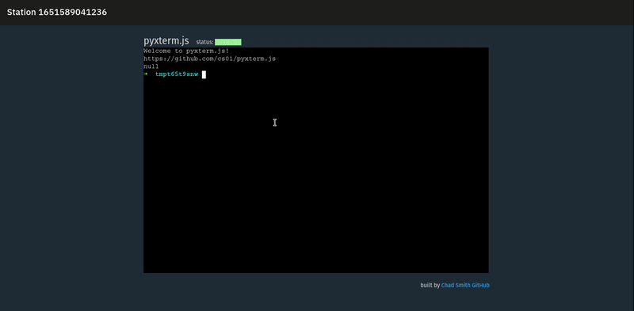
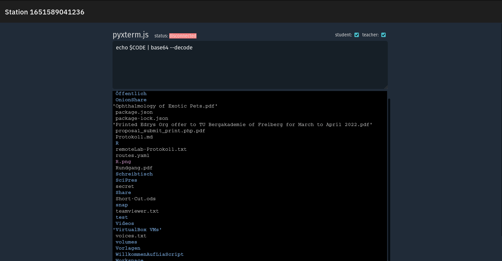

# Edrys PyxTerm.js Module

This module runs a full terminal within [edrys](https://github.com/edrys-org/edrys), an open remote teaching platform.
It is based on [pyxterm.js](https://github.com/cs01/pyxtermjs) by Chad Smith.



## Usage 

To use this URL to add the module to your class:

```bash
https://cross-lab-project.github.io/edrys_module_pyxtermjs
```

additionally you will have to clone this project and start the [pyxterm.js](https://github.com/cs01/pyxtermjs) terminal server:

```bash
python3 -m pyxtermjs --cors True
```

To secure the usage, you can also start a docker-container, which is used as a secure environment or, as it is shown below, you can run and restrict the command-line access via [firejail](https://firejail.wordpress.com/documentation-2/basic-usage/).
The `--private-home` is not necessarily required, it simply copies my zsh configuration to the firejail home folder.

``` bash
python3 -m pyxtermjs --cors True --tmp True --command firejail --cmd-args='--noroot --private --quiet --cpu=1 --nice=19 --hostname=host --net=none --no3d --nosound --rlimit-cpu=1 --allow-debuggers --shell=/bin/zsh --private-home=/home/andre/.zshrc --private-home=/home/andre/.oh-my-zsh'
```

You may optionally specify any of the following station-only settings:

``` json
{ "server": "http://localhost:5000/pty"
, "execute": "pty-execute"
}
```

the `server` contains the default terminal-server, and via execute it is possible to define a subject on which this module will listen for code to be executed. The following view is only visible on station-mode.
Whenever another module sends some code/commands via the predefined "execute"-topic, the script on top will be executed, whereby `$CODE` will be substituted with the code passed from another module.
By default students and teachers cannot directly access the terminal, they will see only the output.
You will have to grant access via the checkboxes, which are only visible on the station.



## API

```
> python3 -m pyxtermjs --help

usage: __main__.py [-h] [-p PORT] [--cors CORS] [--host HOST] [--debug] [--version] [--command COMMAND] [--cmd-args CMD_ARGS] [--tmp TMP]

A fully functional terminal in your browser. https://github.com/cs01/pyxterm.js

optional arguments:
  -h, --help            show this help message and exit
  -p PORT, --port PORT  port to run server on (default: 5000)
  --cors CORS           enable CORS by default this is disabled (default: False)
  --host HOST           host to run server on (use 0.0.0.0 to allow access from other hosts) (default: 127.0.0.1)
  --debug               debug the server (default: False)
  --version             print version and exit (default: False)
  --command COMMAND     Command to run in the terminal (default: bash)
  --cmd-args CMD_ARGS   arguments to pass to command (i.e. --cmd-args='arg1 arg2 --flag') (default: )
  --tmp TMP             use a temporary folder as base, which comes handy when using firejail (default: False)
```
